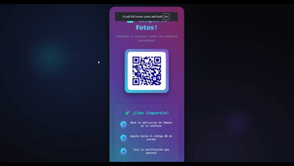
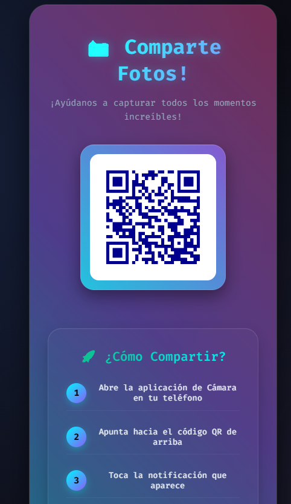
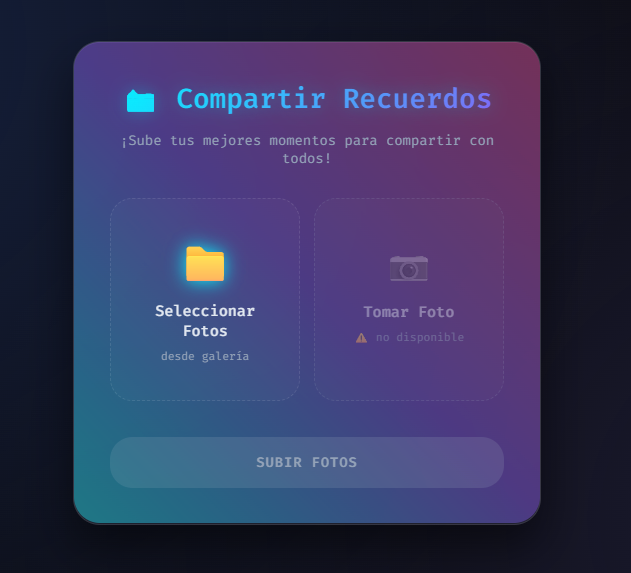
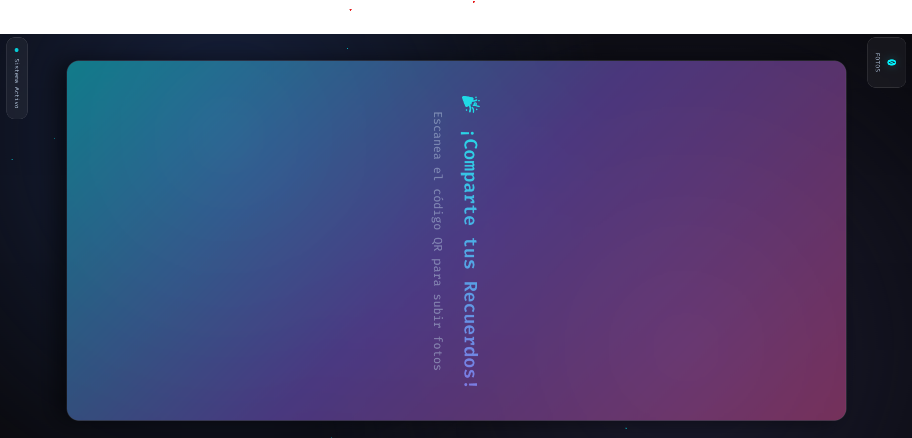

# 📸 Fotos para el Evento

¡Bienvenido! Este es un proyecto de aplicación web diseñado para que los invitados de un evento, como un cumpleaños o una fiesta, puedan compartir sus fotos fácilmente y verlas en una presentación en tiempo real.

<br>

## 🚀 ¿Cómo funciona?

1.  El anfitrión inicia la aplicación en una computadora o dispositivo conectado a la misma red Wi-Fi que los invitados.
2.  La aplicación genera un **código QR** que se muestra en la pantalla principal.
3.  Los invitados escanean el código QR con sus teléfonos, lo que los conecta a la aplicacion y redirige a una página web local para subir sus fotos.
4.  Una vez subidas, las fotos aparecen automáticamente en un **slideshow** que se puede proyectar en una pantalla grande para que todos las vean.

<br>

## ✨ Características Principales

* **Generación de QR Automática:** Al iniciar, la aplicación genera un código QR con la dirección IP local para un acceso rápido y sencillo.

<br>



<br>



<br>

* **Subida de Fotos Simplificada:** Los usuarios pueden subir fotos de manera fácil y rápida desde sus dispositivos móviles.

<br>


<br>



<br>

* **Slideshow en Tiempo Real:** Las fotos se actualizan en el slideshow automáticamente, sin necesidad de recargar la página.

<br>


<br>



<br>

* **Gestión Segura de Archivos:** Cada foto subida recibe un nombre único (**UUID**) para evitar errores causados por espacios o caracteres especiales en los nombres de los archivos.

---

<br>

## 🛠️ Requisitos del Sistema

* **Python 3.x**
* **Pip** (gestor de paquetes de Python)
* **Uv** (Opcional pero recomendado, tu vida sera mas facil si lo usas)

## 💻 Instalación y Uso

Sigue estos pasos para poner a funcionar el proyecto:

- **Clona este repositorio** (o descarga los archivos si los tienes en una carpeta local).

- **Instala las dependencias necesarias** usando `pip` o `uv`. Abre una terminal en la carpeta del proyecto y ejecuta el siguiente comando:

#### Con Pyhton y Pip

1. **Genera entorno virtual con python**

```bash
$ python -m venv .venv
```

2. **Activa entorno**

```bash
source .venv/bin/activate
```

3. **Instala las dependencias con pip**

```bash
pip install -e .
```

4. **Ejecuta la aplicacion, una vez ejecutada tu navegador predeterminado se abrira en la ruta del Qr generado**

```bash
./.venv/bin/python3 app.py
```

#### Con UV

1. **Genera el entorno virtual e instala las dependencias:**

```bash
uv sync
```

2. **Ejecuta la aplicacion, una vez ejecutada tu navegador predeterminado se abrira en la ruta del Qr generado**

```bash
./.venv/bin/python3 app.py
```

o con

```bash
uv run app.py
```

<br>

---

<br>

## 📁 Estructura del Proyecto

* `app.py`: El cerebro de la aplicación, un servidor Flask que maneja las rutas y la lógica principal.
* `upload.html`: La plantilla HTML para la página de subida de fotos.
* `display.html`: La plantilla HTML para el slideshow que muestra las imágenes.
* `uploads/`: Contiene los archivos estáticos como las imágenes subidas (`uploads`).
* `qr.html`: Directorio donde se guarda la imagen del código QR generado.

<br>

```bash
 .
├──  app.py
├──  templates
├──────  display.html
├──────  qr.html
├──────  upload.html
├───  static
├──────  qr_code.png
├──  Scripts
├──  assets
├──  uploads
├──  .python-version
├──  app.py
├──  pyproject.toml
├──  README.md
└──  TODO.md
```